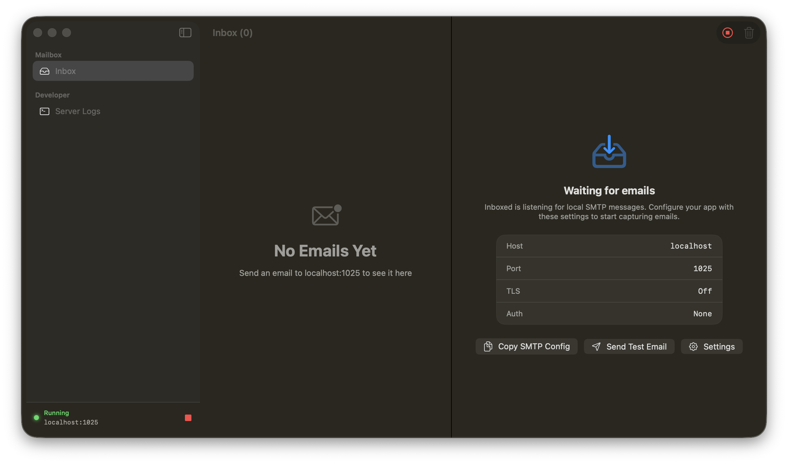

# Inboxed



Inboxed is a native macOS SMTP catcher for local development. It runs a local SMTP server, captures outbound emails from your apps, and previews plain text, HTML, raw MIME content, and SMTP logs without forwarding anything outside your machine.

## Features

| Feature | Details |
|---|---|
| Local SMTP server | Listens on `localhost:1025` by default |
| Native macOS UI | SwiftUI app with sidebar, inbox list, preview pane, and Settings |
| HTML preview | Renders HTML emails with `WKWebView` |
| External link handling | Links clicked inside email previews open in the default browser |
| MIME parsing | Supports multipart email, plain text, HTML, base64, quoted-printable, and encoded subjects |
| Settings | Use `Cmd + ,` to change the SMTP port; running server restarts automatically |
| Empty-state setup | Shows SMTP config, copy action, and a built-in test email helper |
| Notifications | Shows a macOS notification when an email is captured |
| Logs | Includes a live SMTP traffic/log view |

## Requirements

- macOS 14+
- Xcode 26+ or the matching command line tools
- Swift Package Manager

## Run Locally

From the project directory:

```bash
swift build
swift run Inboxed
```

`swift run Inboxed` is useful for development. macOS notifications are only enabled when Inboxed is launched from an `.app` bundle.

For an app-bundle style local run:

```bash
swift build
BIN_DIR="$(swift build --show-bin-path)"
mkdir -p "Inboxed.app/Contents/MacOS" "Inboxed.app/Contents/Resources"
cp "$BIN_DIR/Inboxed" "Inboxed.app/Contents/MacOS/Inboxed"
cp "Resources/Inboxed.icns" "Inboxed.app/Contents/Resources/Inboxed.icns"
cat > "Inboxed.app/Contents/Info.plist" <<'EOF'
<?xml version="1.0" encoding="UTF-8"?>
<!DOCTYPE plist PUBLIC "-//Apple//DTD PLIST 1.0//EN" "http://www.apple.com/DTDs/PropertyList-1.0.dtd">
<plist version="1.0">
<dict>
  <key>CFBundleExecutable</key>
  <string>Inboxed</string>
  <key>CFBundleIdentifier</key>
  <string>dev.inboxed.Inboxed</string>
  <key>CFBundleName</key>
  <string>Inboxed</string>
  <key>CFBundleDisplayName</key>
  <string>Inboxed</string>
  <key>CFBundleIconFile</key>
  <string>Inboxed</string>
  <key>CFBundlePackageType</key>
  <string>APPL</string>
  <key>CFBundleShortVersionString</key>
  <string>1.0</string>
  <key>LSMinimumSystemVersion</key>
  <string>14.0</string>
  <key>NSHighResolutionCapable</key>
  <true/>
</dict>
</plist>
EOF
codesign --force --deep --sign - "Inboxed.app"
open "Inboxed.app"
```

The app starts the SMTP server automatically. The current status and port are shown in the sidebar footer.

## SMTP Configuration

Configure your app's mailer with:

| Setting | Value |
|---|---|
| Host | `localhost` |
| Port | `1025` by default |
| TLS | Off |
| Auth | None |

To change the port, open **Inboxed > Settings** or press `Cmd + ,`. If the server is running, saving a new port restarts the listener automatically.

## Send a Test Email

Plain text:

```bash
python3 - <<'PYEOF'
import smtplib
from email.mime.text import MIMEText

msg = MIMEText('Hello from Inboxed!', 'plain')
msg['Subject'] = 'Test Email'
msg['From'] = 'dev@local.test'
msg['To'] = 'you@local.test'

with smtplib.SMTP('localhost', 1025) as smtp:
    smtp.send_message(msg)

print('Sent!')
PYEOF
```

HTML + plain text multipart:

```bash
python3 - <<'PYEOF'
import smtplib
from email.mime.multipart import MIMEMultipart
from email.mime.text import MIMEText

msg = MIMEMultipart('alternative')
msg['Subject'] = 'HTML Test Email'
msg['From'] = 'dev@local.test'
msg['To'] = 'you@local.test'

msg.attach(MIMEText('This is the plain text fallback.', 'plain'))
msg.attach(MIMEText('''
<!doctype html>
<html>
<body style="font-family:-apple-system;padding:32px;background:#f6f7fb;">
  <div style="max-width:560px;margin:auto;background:white;border-radius:16px;padding:28px;">
    <h1>Inboxed HTML Preview</h1>
    <p>This email is rendered inside Inboxed.</p>
    <a href="https://example.com">External link test</a>
  </div>
</body>
</html>
''', 'html'))

with smtplib.SMTP('localhost', 1025) as smtp:
    smtp.send_message(msg)

print('Sent!')
PYEOF
```

## Release Builds

Release builds are created by GitHub Actions when a `v*` tag is pushed, for example:

```bash
git tag v1.0.0
git push origin v1.0.0
```

The workflow builds `Inboxed`, packages `Inboxed.app`, zips it, and publishes it to the GitHub release.

Release builds are currently unsigned. After downloading and unzipping a release, you can ad-hoc sign it locally:

```bash
codesign --force --deep --sign - "Inboxed.app"
```

If macOS still blocks the app because it was downloaded from the internet, remove the quarantine attribute and sign again:

```bash
xattr -dr com.apple.quarantine "Inboxed.app"
codesign --force --deep --sign - "Inboxed.app"
open "Inboxed.app"
```

Alternatively, right-click `Inboxed.app` and choose **Open** the first time.

## Notes

- Inboxed is meant for local development only.
- Emails are kept in memory for the current app session.
- Inboxed never forwards or delivers email to real recipients.

## Credits

- App icon by [akid3v](https://macosicons.com/u/akid3v) via [macOSicons](https://macosicons.com/).
